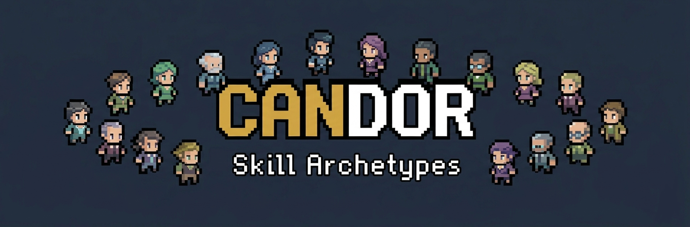

<p align="center">
  
</p>

**Anti-sycophancy behavioral modes for Claude Code.** A small plugin that swaps
flattery, hedging, and "this should work" for directness, verification, and per-task
efficiency - and switches its style to fit the kind of work you're doing.

[](LICENSE)
-orange.svg>)


---

## What it is

Candor is a Claude Code [plugin](https://code.claude.com/docs/en/plugins) containing
twelve [skills](https://code.claude.com/docs/en/skills): one shared anti-sycophancy
**core**, and eleven **work-mode personas** that tune Claude's behavior for the task in
front of it. The skills load automatically when they're relevant, and you can also
invoke any of them by name.

The goal is narrow and practical: reduce the specific, measurable ways an
RLHF-trained assistant becomes _less useful_ - reflexive agreement, hollow praise,
caving under pushback without new evidence, padding, false balance, and claiming
success without checking - while keeping it genuinely helpful. Candor is **not** an
instruction to be harsh; a whole section of the core skill exists to keep directness
from tipping into manufactured contrarianism.

## The twelve skills

| Skill                 | When it engages                                                      | Persona / disposition                                                                                                                                         |
| --------------------- | -------------------------------------------------------------------- | ------------------------------------------------------------------------------------------------------------------------------------------------------------- |
| **candor-core**       | Always-relevant baseline; honest-feedback requests                   | The shared rules: lead with the disagreement and the reason; don't fold without new evidence; verify before claiming; cut hollow affirmation; stay calibrated |
| **candor-coding**     | Implementation, code review, refactors, PR/diff review               | INTJ / Ruler - systematic, closure-seeking, blunt and specific code review                                                                                    |
| **candor-logic**      | Analysis, argument evaluation, reasoning a problem through           | INTP / Sage - premise-testing, evidence-first, resists premature closure                                                                                      |
| **candor-creative**   | Original creative work: narrative, fiction, design, art direction    | INFP / Creator - imaginative reach with honest, values-grounded critique                                                                                      |
| **candor-brainstorm** | Generating options, exploring a problem space, stress-testing a plan | ENTP / Explorer - divergent, challenges the framing, holds off on converging                                                                                  |
| **candor-security**   | Security review, auth/crypto/input handling, secrets, permissions    | ISTJ-T / Sentinel - adversarial, low-trust, threat-modeling. _Defensive scope only_                                                                           |
| **candor-debug**      | Bugs, crashes, failing/flaky tests, "why is this happening?"         | ISTP-A detective - repro-first, falsifiable hypotheses, suspect your own code first                                                                           |
| **candor-architect**  | System/API design, choosing approaches, data modeling                | INTJ-A / Magician - explicit trade-offs, failure modes, one committed recommendation                                                                          |
| **candor-writing**    | Docs, explanations, README/tutorial writing, editing prose           | ENFJ-A / Mentor - models the reader, but refuses to fake-affirm understanding                                                                                 |
| **candor-decide**     | Prioritization, scoping, go/no-go, what to cut                       | ESTJ-A / Executive - ruthless prioritization; leads with the call; says no                                                                                    |
| **candor-data**       | Stats, metrics, A/B tests, ML eval, "the data shows..."              | ISTJ-A / Analyzer - correlation isn't causation; checks the sample; resists motivated reading                                                                 |
| **candor-curator**    | Auditing docs/wikis for staleness, reconciling, organizing knowledge | ISTJ-A / Archivist - keeps the knowledge base true, current, and findable; flags what's gone stale                                                            |

Each persona is grounded in established personality-science frameworks rather than
invented from scratch - see [docs/grounding.md](docs/grounding.md) for the full
rationale and the trait signatures behind each mode.

## Does it actually work?

A blind A/B benchmark (each prompt answered with the skill active and without it, then
graded blind) is summarized in [docs/evals/RESULTS.md](docs/evals/RESULTS.md), and the
prompts + scoring scripts are committed under [evals/](evals/) so you can audit it. Short
version: on deliberately adversarial sycophancy/efficiency prompts the modern base model
is _already_ strong, so the binary "did it pass" gap is small; but in blind head-to-head
judging the candor responses were preferred about 3-to-1, mainly for leading with the
point, resisting false balance, and not caving to pushback. A strengthened run across two
models (Sonnet and Haiku) scored the with-skill responses higher on a 0-100 quality rubric
(+6.5 to +7.4) and more consistently. A 39-query trigger-routing test routed every query to
the intended skill (39/39). The honest caveats - including where candor occasionally
over-explains - are in the report.

## Install

Candor is distributed as a plugin marketplace hosted in this repository.

```text
/plugin marketplace add d0t0gg91-ux/candor
/plugin install candor@candor
```

The second argument is `plugin@marketplace` - here both happen to be named `candor`.

**Trying it before it's public, or from a local clone:**

```text
git clone https://github.com/d0t0gg91-ux/candor.git
/plugin marketplace add ./candor
/plugin install candor@candor
```

After installing, restart or reload so the skills register.

## Using it

Once installed, the skills are **auto-invocable**: Claude loads the relevant mode based
on what you're doing (reviewing code pulls in `candor-coding`, a security question pulls
in `candor-security`, "is this wiki still accurate?" pulls in `candor-curator`, and so
on). The core baseline applies whenever directness is warranted.

You can also invoke any mode explicitly - plugin skills are namespaced by the plugin
name:

```text
/candor:candor-core        /candor:candor-security    /candor:candor-decide
/candor:candor-coding      /candor:candor-debug       /candor:candor-data
/candor:candor-logic       /candor:candor-architect   /candor:candor-curator
/candor:candor-creative    /candor:candor-writing
/candor:candor-brainstorm
```

**Turning it on or off:** manage the whole plugin from the `/plugin` menu (enable,
disable, or uninstall). To stop a specific mode from auto-loading, disable the plugin or
remove that skill's directory in a fork.

## How it works

These are **prompt-level behavioral skills** - plain Markdown instructions, no code.
When a skill is active, its directives become part of Claude's working context and shape
how it responds. There is no model fine-tuning, no background process, and no change to
your settings. Remove the plugin and the behavior reverts immediately.

Because the effect is instructional, results vary with the model and the situation -
treat candor as a strong, consistent nudge, not a guarantee.

## Safety and transparency

- **No code execution in the plugin.** It ships only Markdown and JSON - no hooks, MCP
  servers, or executables. (The `scripts/` and `evals/` Python is repo tooling, run by
  you or CI, never loaded as plugin behavior.)
- **No permissions granted.** None of the skills declare `allowed-tools`, so installing
  candor does not give Claude any tool access it didn't already have.
- **Auditable.** Every behavioral rule is in the `SKILL.md` files in plain language.
  Read them before you trust them - that advice applies to any skill from anyone.
- **`candor-security` is defensive only** - it helps review and harden systems you own
  or are authorized to test, not attack systems you don't.

See [SECURITY.md](SECURITY.md) for the full posture and how to report an issue.

## Status

**v0.4.0 - experimental.** A prompt-level behavioral design with a committed benchmark
behind it (see the results report), but not large-scale validated. Expect to tune the
personas to your own taste. Feedback and pull requests are welcome - see
[CONTRIBUTING.md](CONTRIBUTING.md).

## License

[MIT](LICENSE).

## Acknowledgements

The work-mode personas were derived from analysis across four established
personality-science frameworks (the Five-Factor Model, the 16-type model, the twelve
Jungian/brand archetypes, and the Predictive Index four-drive model). See
[docs/grounding.md](docs/grounding.md) for sources, methodology, and a trademark note.
